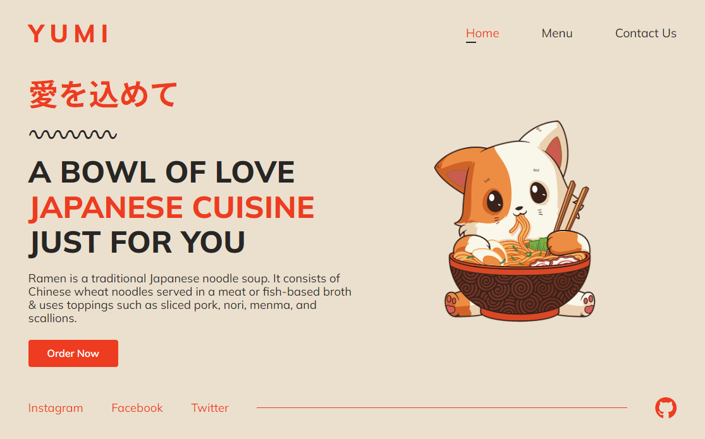
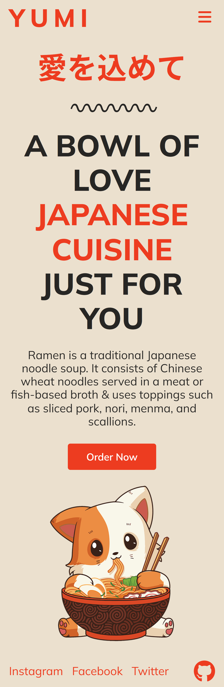

<div align="center">
  
  <h1>Yumi: Restaurant Website</h1>

  <p>
  Ramen establishment website with Home, Menu and Contact pages
  </p>

  <p>
    <a href="https://github.com/danxschz/restaurant-page/graphs/contributors">
      
    </a>
    <a href="https://github.com/danxschz/restaurant-page/commits/main">
      
    </a>
    <a href="https://github.com/danxschz/restaurant-page/blob/master/LICENSE">
      
    </a>
  </p>

  <h4>
    <a href="https://yum.danxschz.com">View Demo</a>
    <span> · </span>
    <a href="https://github.com/danxschz/restaurant-page/issues/">Report Bug</a>
  </h4>
</div>

<br>

## About the Project

### Screenshots

<div align="center">
  <h3>Desktop</h3>
  

  <h3>Mobile</h3>
  
</div>

### Built With

- HTML
- CSS
- JavaScript
- Sass
- Webpack
- npm

### Color Reference

| Color      | Hex     |
| :--------: | :-----: |
| Background | #EBE0CE |
| Primary    | #ED3C20 |
| Text       | #272624 |

## Getting Started

### Run Locally

In order to setup and work on this project on your own, you will need to:

Clone the project

```bash
  git clone https://github.com/danxschz/restaurant-page.git
```

Go to the project directory

```bash
  cd restaurant-page
```

Install dependencies

```bash
  npm install
```

## License

Distributed under the MIT License. See LICENSE for more information.

## Contact

Daniel Sanchez (@danxschz) · [Portfolio](https://danxschz.com/) · danxschz@gmail.com
