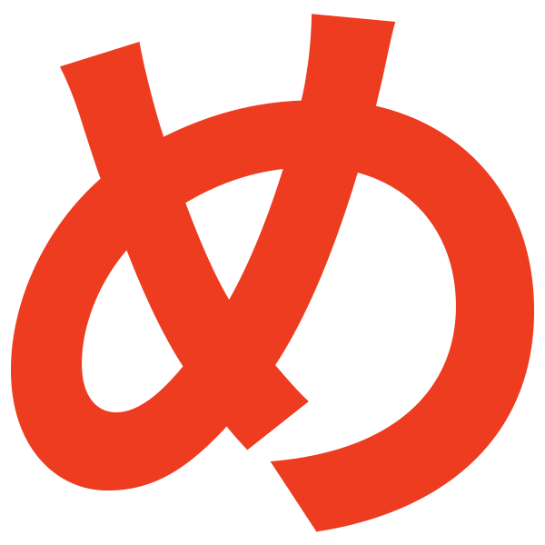

<div align="center">
  
  <h1>Restaurant Page</h1>

  <p>
  Restaurant web page for a fictional ramen establishment named Yumi
  </p>

  <p>
    <a href="https://github.com/danxschz/restaurant-page/graphs/contributors">
      
    </a>
    <a href="https://github.com/danxschz/restaurant-page/commits/main">
      
    </a>
    <a href="https://github.com/danxschz/restaurant-page/blob/master/LICENSE">
      
    </a>
  </p>

  <h4>
    <a href="https://danxschz.github.io/restaurant-page">View Demo</a>
    <span> · </span>
    <a href="https://github.com/danxschz/restaurant-page/issues/">Report Bug</a>
  </h4>
</div>

<br>

## About the Project

### Built With

- HTML
- CSS
- JavaScript
- Sass
- npm
- webpack

### Color Reference

| Color             | Hex                                                                |
| ----------------- | ------------------------------------------------------------------ |
| Primary Color | #EBE0CE |
| Accent Color | #00ADB5 |
| Text Color | #ED3C20 |

## Getting Started

### Run Locally

In order to setup and work on this project on your own, you will need to:

Clone the project

```bash
  git clone https://github.com/danxschz/restaurant-page.git
```

Go to the project directory

```bash
  cd restaurant-page
```

Install dependencies

```bash
  npm install
```

## License

Distributed under the MIT License. See LICENSE for more information.

## Contact

Daniel Sanchez - danxschz@gmail.com